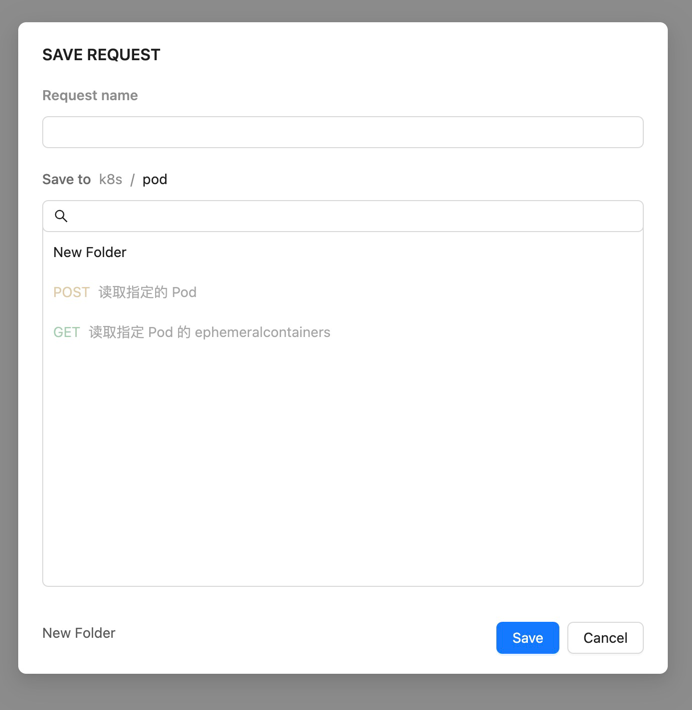

# Antd 开发 Postman组件库

## SaveAs 组件




http://localhost:8000/arex-remocollab/#/modal/request/save

```js
const initValue = {
    requestName:'',
  treeData:[],
  onNewFolder: (newFolderName, parentFolderId) => {
    console.log('onNewFolder', newFolderName, parentFolderId);
  },
  onSave: (selectedFolderId) => {
    console.log('onSave', selectedFolderId);
  },
}
```
